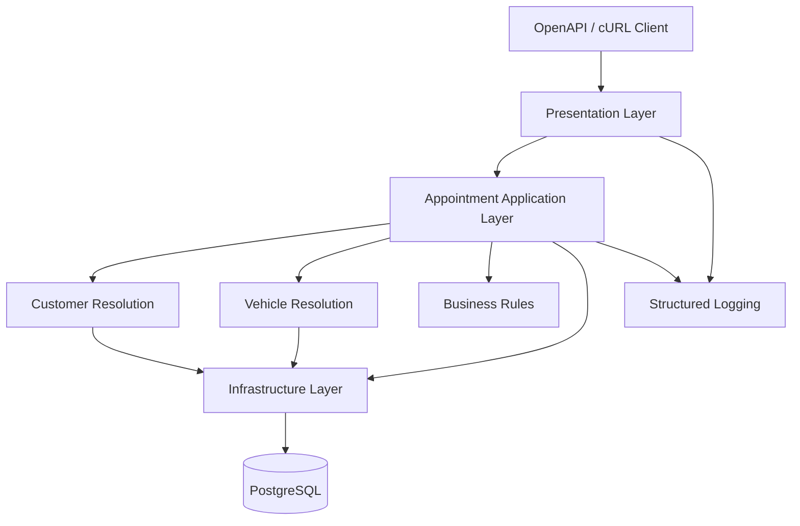
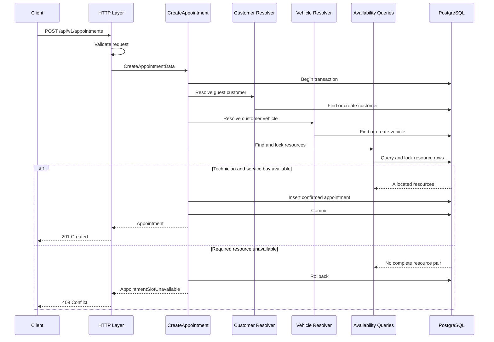
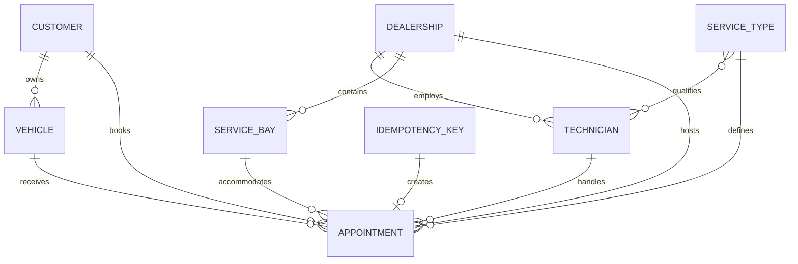

# Unified Service Scheduler — System Design

## Overview

The Unified Service Scheduler replaces manual dealership booking with a backend API that confirms an appointment only when both a qualified technician and a service bay are available for the complete service duration. The implementation prioritizes correctness under concurrent requests, explicit business rules, persistent records, testability, and operational visibility.

## Problem Statement

The current dealership booking process is manual and error-prone. It can
allocate the same technician or service bay to overlapping appointments,
making resource availability unreliable.

The manual process also makes it difficult to verify technician qualifications,
preserve a trustworthy appointment record, associate repeat bookings with the
same customer, and investigate booking failures.

The scheduler must provide a deterministic workflow that resolves the guest
customer and vehicle, calculates the complete service period, allocates both
required resources, and persists the confirmed appointment atomically.

## Acceptance Criteria

### AC-01: Request a Service Appointment

The backend must allow a guest client to request a service appointment by
providing:

- The customer's name
- At least one contact identifier: email address or phone number
- The vehicle information
- The requested service type
- The selected dealership
- The desired start time

The backend exposes the following RESTful endpoint:

`POST /api/v1/appointments`

Authentication is outside the MVP scope. The customer contact information is
included in the request so that the backend can associate repeat bookings with
the same guest customer profile.

The requested end time is not supplied by the client. The server calculates it
using the configured duration of the selected service type.

This criterion is satisfied when a structurally valid request is accepted for
processing, while invalid input is rejected with HTTP `422 Unprocessable Entity`.

### AC-02: Check Resource Availability

Before confirming an appointment, the backend must verify that:

- A qualified technician is available for the entire service duration.
- A service bay is available for the entire service duration.
- Both resources belong to the selected dealership.

For this implementation, a technician is considered qualified when they:

- Are active.
- Belong to the selected dealership.
- Support the requested service type.

A resource is considered available when it has no confirmed appointment that
overlaps the requested appointment period.

This criterion is satisfied when the system prevents confirmation if either a
qualified technician or a service bay is unavailable for any portion of the
service duration.

### AC-03: Persist the Confirmed Appointment

When both a qualified technician and a service bay are available for the
complete service duration, the backend must create a persistent appointment
record in PostgreSQL.

The confirmed appointment must associate:

- The customer
- The vehicle
- The dealership
- The service type
- The assigned technician
- The assigned service bay
- The complete appointment period
- The appointment status

The customer, vehicle, resource allocation, and appointment must be persisted
atomically. If either required resource cannot be allocated, no appointment
record may be created.

For a new guest customer, the customer and vehicle records must also be rolled
back if appointment confirmation fails.

This criterion is satisfied when the API returns HTTP `201 Created` and the
confirmed appointment can be retrieved from PostgreSQL with all required
associations.

### Acceptance Criteria Traceability

| ID | Implementation | Verification |
|---|---|---|
| AC-01 | `StoreAppointmentRequest` and `POST /api/v1/appointments` | A valid guest booking request is accepted; malformed input returns HTTP 422 |
| AC-02 | `TimeRange`, `FindAvailableTechnician`, and `FindAvailableServiceBay` | Tests cover qualification, dealership ownership, busy resources, partial overlap, and boundary times |
| AC-03 | Transactional `CreateAppointment` use case | Assert HTTP 201 and verify the customer, vehicle, technician, service bay, and appointment records in PostgreSQL |

## Scope and Non-goals

### In Scope

The implementation includes:

- A RESTful backend API
- Guest customer booking without authentication
- Guest customer matching using normalized email or phone
- Guest vehicle resolution
- Service-duration calculation
- Qualified technician availability
- Service bay availability
- An advisory availability-check endpoint that does not reserve resources
- Time-overlap detection
- Transactional appointment creation
- PostgreSQL persistence
- Concurrency protection against double booking
- Standardized success and error responses
- Structured logging and request correlation
- Automated tests for the core business logic
- OpenAPI and cURL examples as the client-side stub
- Idempotent appointment creation using an `Idempotency-Key`

### Non-goals

The following capabilities are outside the MVP scope:

- A production frontend
- Customer authentication and authorization
- Password creation
- Email or phone ownership verification
- Public access to customer appointment history
- Payments
- Email or SMS notifications
- Customer, vehicle, and dealership CRUD APIs
- Appointment rescheduling
- Holiday and technician-shift calendars
- Advanced technician workload balancing
- Microservices deployment
- A production monitoring stack

## Assumptions

The challenge brief leaves some operational rules unspecified. The following
assumptions are applied to keep the implementation deterministic and within the
challenge scope.

### Guest Customer Matching Policy

Customer matching follows these deterministic rules:

1. If neither normalized email nor normalized phone matches an existing
   customer, a new guest customer profile is created.
2. If both identifiers match the same customer, that customer is reused.
3. If only one contact identifier is supplied and it matches an existing
   customer, that customer is reused.
4. If one identifier matches an existing customer and the other supplied
   identifier corresponds to an empty stored field, the missing identifier may
   be added to that customer.
5. An existing non-empty contact identifier is never overwritten automatically.
6. If the email and phone match different customers, the request is rejected
   with `CUSTOMER_IDENTITY_CONFLICT`.
7. If one identifier matches a customer but another supplied identifier
   conflicts with a non-empty stored value, the request is rejected with
   `CUSTOMER_IDENTITY_CONFLICT`.

### Vehicle Assumptions

- A vehicle is identified within a customer profile using its normalized
  registration number.
- An existing matching vehicle is reused for repeat bookings.
- A new vehicle is created when no matching vehicle exists for the resolved
  customer.

### Scheduling Assumptions

- Each service type has a predefined duration in minutes.
- The client provides the desired start time, and the server calculates the
  appointment end time.
- A technician is qualified when they are active, belong to the selected
  dealership, and support the requested service type.
- The system automatically selects the first available qualified technician
  and service bay using deterministic ordering.
- Appointment periods use the half-open interval `[start_at, end_at)`.
- An appointment may start exactly when the preceding appointment ends.
- API timestamps include an explicit timezone and are normalized to UTC before
  persistence.
- For the MVP, `confirmed` is the only appointment status that reserves a
  technician and service bay.
- The availability-check endpoint is advisory and does not reserve resources.
- Appointment creation always rechecks availability inside its transaction.

## Business Invariants

The following conditions must remain true regardless of request order, retries,
or failures.

### Customer and Vehicle Invariants

1. Every confirmed appointment must be associated with exactly one customer.
2. At least one customer contact identifier, email or phone, must be provided.
3. A matching guest customer profile must be reused instead of duplicated.
4. If the supplied email and phone match different customer profiles, the
   profiles must not be merged automatically.
5. A vehicle must belong to the resolved customer.
6. A new customer and vehicle must not remain persisted if appointment creation
   fails.

### Resource Invariants

7. The assigned technician must belong to the selected dealership.
8. The assigned service bay must belong to the selected dealership.
9. The assigned technician must support the requested service type.
10. A technician must not have multiple confirmed appointments with
    overlapping periods.
11. A service bay must not have multiple confirmed appointments with
    overlapping periods.

### Appointment Invariants

12. The appointment end time must be later than its start time.
13. An appointment must not be created unless both a qualified technician and a
    service bay have been allocated.
14. Customer resolution, vehicle resolution, resource allocation, and
    appointment creation must be atomic.
15. A failed operation must not leave a partial appointment.
16. Repeating the same idempotent booking request must not create another
    appointment.

## Architecture

The Unified Service Scheduler is implemented as a modular monolith using a
pragmatic layered architecture and feature-oriented code organization.

The system consists of:

- A single Laravel application
- A single PostgreSQL database
- A RESTful API
- OpenAPI documentation and cURL examples as the client-side stub
- A single deployment unit

The application is separated internally into presentation, application,
business-rule, and infrastructure responsibilities.

### Architecture Diagram



### Architecture Rationale

A modular monolith was selected because the challenge requires a single backend
service and has a limited delivery window. A microservices architecture would
introduce additional deployment, communication, distributed transaction, and
observability complexity without supporting a current requirement.

The pragmatic layered architecture separates HTTP handling, application
workflow, business rules, and persistence responsibilities. This keeps the core
appointment workflow testable and prevents controllers and Eloquent models from
accumulating unrelated business logic.

Feature-oriented organization groups appointment, customer, and vehicle
capabilities by business purpose while preserving standard Laravel conventions
for HTTP components and Eloquent models.

Focused Query Objects are used instead of generic repositories because Eloquent
is the only persistence implementation in the current system. Generic CRUD
repositories would duplicate the ORM without providing meaningful isolation.

Repository interfaces may become justified if the system later introduces pure
domain entities, multiple persistence implementations, a legacy database, or an
external scheduling provider.

## Component Responsibilities

| Component | Responsibility | Must Not Do |
|---|---|---|
| API Controller | Receives HTTP requests, invokes an application use case, and returns a standardized response | Execute availability queries or control database transactions |
| Form Request | Validates required fields, contact information, entity identifiers, and timestamp formats | Allocate resources or create appointments |
| DTO | Carries validated, typed, and immutable use-case input | Access the database or depend on HTTP objects |
| ResolveGuestCustomer | Resolves an existing guest customer or creates a new customer profile | Confirm resource availability |
| ResolveCustomerVehicle | Resolves or creates a vehicle belonging to the resolved customer | Assign the vehicle to another customer |
| CreateAppointment | Orchestrates customer resolution, vehicle resolution, resource allocation, and appointment persistence | Build HTTP responses |
| CheckAvailability | Calculates the requested period and checks whether both required resources are currently available | Guarantee that resources remain available for later requests |
| FindAvailableTechnician | Finds a qualified and available technician for the requested period | Control the complete appointment workflow |
| FindAvailableServiceBay | Finds an available service bay for the requested period | Create the appointment |
| TimeRange | Represents a valid appointment period and provides overlap behavior | Query the database or depend on Laravel HTTP classes |
| Eloquent Models | Map persisted records and relationships | Contain every appointment use case |
| PostgreSQL | Provides persistence, foreign keys, indexes, transactions, and resource locking | Define HTTP response behavior |
| Domain Exception | Represents an expected business failure | Return an HTTP response directly |
| Exception Renderer | Converts expected failures into standardized API errors | Decide business rules |
| Request ID Middleware | Creates or propagates a request identifier and adds it to log context | Process appointment business logic |
| API Resource | Converts application results into a stable API representation | Perform persistence or resource allocation |

## Layer and Directory Structure

The source code is organized by business feature while standard Laravel
conventions are retained for HTTP components and Eloquent models.

```text
app/
├── Appointment/ 
│   ├── Actions/
│   │   ├── CheckAvailability.php
│   │   └── CreateAppointment.php
│   ├── Data/
│   │   ├── CheckAvailabilityData.php
│   │   ├── AvailabilityResult.php
│   │   └── CreateAppointmentData.php
│   ├── Enums/
│   │   └── AppointmentStatus.php
│   ├── Exceptions/
│   │   └── AppointmentSlotUnavailable.php
│   ├── Queries/
│   │   ├── FindAvailableTechnician.php
│   │   └── FindAvailableServiceBay.php
│   └── ValueObjects/
│       └── TimeRange.php
├── Customer/
│   ├── Actions/
│   │   └── ResolveGuestCustomer.php
│   ├── Data/
│   │   └── GuestCustomerData.php
│   └── Exceptions/
│       └── CustomerIdentityConflict.php
├── Vehicle/
│   ├── Actions/
│   │   └── ResolveCustomerVehicle.php
│   ├── Data/
│   │   └── VehicleData.php
│   └── Exceptions/
│       └── VehicleOwnershipConflict.php
├── Http/
│   ├── Controllers/
│   │   └── Api/
│   │       └── V1/
│   │           ├── AppointmentController.php
│   │           └── AvailabilityController.php
│   ├── Middleware/
│   │   └── AssignRequestId.php
│   ├── Requests/
│   │   ├── CheckAvailabilityRequest.php
│   │   └── StoreAppointmentRequest.php
│   ├── Resources/
│   │   ├── AppointmentResource.php
│   │   └── AvailabilityResource.php
│   └── Responses/
│       └── ApiResponse.php
├── Models/
│   ├── Appointment.php
│   ├── Customer.php
│   ├── Dealership.php
│   ├── ServiceBay.php
│   ├── ServiceType.php
│   ├── Technician.php
│   └── Vehicle.php
└── Shared/
    └── Exceptions/
        ├── DomainException.php
        └── ErrorCode.php
```

### Layer Responsibilities

#### Presentation Layer

The presentation layer contains routes, controllers, Form Requests, API
Resources, middleware, and response formatting.

It is responsible for:

- Receiving HTTP requests
- Validating request structure
- Converting validated input into DTOs
- Calling application use cases
- Converting application results into HTTP responses
- Mapping expected failures to stable API errors

It must not contain customer resolution, resource allocation, availability
queries, or transaction logic.

#### Application Layer

The application layer contains Actions and DTOs.

It is responsible for:

- Coordinating complete use cases
- Defining transaction boundaries
- Invoking customer, vehicle, and resource-resolution components
- Returning application results or raising expected domain exceptions

`CreateAppointment` is an application service named after its specific use case.
This prevents a generic `AppointmentService` from accumulating unrelated
behavior.

#### Business-Rule Layer

The business-rule layer contains value objects, enums, and domain exceptions.

It is responsible for:

- Representing valid appointment periods
- Defining time-overlap behavior
- Representing appointment lifecycle status
- Protecting business invariants
- Expressing expected failures such as unavailable resources and conflicting
  customer identities

#### Infrastructure Layer

The infrastructure layer contains Eloquent models, Query Objects, PostgreSQL
transactions, resource locking, and logging integrations.

It is responsible for:

- Loading and persisting records
- Executing availability queries
- Enforcing database constraints
- Managing transactions and resource locks
- Writing structured operational logs

### Dependency Rules

The implementation follows these dependency rules:

- Controllers may depend on Form Requests, DTOs, Actions, API Resources, and
  response formatters.
- Actions may depend on DTOs, Value Objects, Query Objects, domain exceptions,
  Eloquent models, and transaction services.
- Query Objects may depend on Eloquent models and PostgreSQL-specific query
  capabilities.
- Value Objects must not depend on controllers, HTTP requests, API Resources, or
  Eloquent models.
- Domain exceptions must not construct HTTP responses.
- Eloquent models must not depend on controllers or Form Requests.

The following dependencies are intentionally avoided:

```text
TimeRange → Controller
Model → Form Request
Query Object → JsonResponse
CreateAppointment → AppointmentResource
DTO → HTTP Request
```

## Data Flow

### Successful Appointment Flow

1. The guest client sends `POST /api/v1/appointments`.
2. `StoreAppointmentRequest` validates the customer contact information,
   vehicle information, dealership, service type, and desired start time.
3. `AppointmentController` converts the validated input into
   `CreateAppointmentData`.
4. `CreateAppointment` begins a PostgreSQL transaction.
5. `ResolveGuestCustomer` normalizes the supplied email and phone.
6. The system searches for an existing customer using the normalized contact
   identifiers.
7. If a consistent customer match exists, the existing profile is reused.
8. If no customer match exists, a new guest customer profile is created within
   the transaction.
9. `ResolveCustomerVehicle` normalizes the registration number and resolves or
   creates a vehicle belonging to the customer.
10. The selected service type is loaded and its configured duration is used to
    calculate the appointment end time.
11. A `TimeRange` is created for the complete appointment period.
12. `FindAvailableTechnician` finds and locks a qualified technician.
13. `FindAvailableServiceBay` finds and locks an available service bay.
14. Availability is rechecked after the resource locks have been acquired.
15. The confirmed appointment is inserted with all required associations.
16. The transaction commits.
17. The API returns HTTP `201 Created` with the standardized appointment
    response.



### Customer Identity Conflict Flow

A customer identity conflict occurs when the supplied normalized email and
phone match two different customer profiles, or when one identifier matches an
existing customer while another supplied identifier conflicts with a non-empty
stored value.

In this case:

1. The profiles are not merged automatically.
2. The appointment transaction is rolled back.
3. No new customer, vehicle, or appointment is persisted.
4. The API returns HTTP `409 Conflict`.
5. The error code is `CUSTOMER_IDENTITY_CONFLICT`.

### Vehicle Ownership Conflict Flow

A vehicle ownership conflict occurs when the normalized registration number
already belongs to a different customer.

In this case:

1. The vehicle is not reassigned automatically.
2. The appointment transaction is rolled back.
3. No customer, vehicle, or appointment changes are persisted.
4. The API returns HTTP `409 Conflict`.
5. The error code is `VEHICLE_OWNERSHIP_CONFLICT`.

### Resource Unavailable Flow

If either a qualified technician or a service bay cannot be allocated for the
complete service duration:

1. The appointment transaction is rolled back.
2. A newly created guest customer is not persisted.
3. A newly created vehicle is not persisted.
4. No partial appointment record is created.
5. The API returns HTTP `409 Conflict`.
6. The error code is `APPOINTMENT_SLOT_UNAVAILABLE`.

### Validation Failure Flow

If the request is missing required information or contains invalid data:

1. The request is rejected before the appointment use case starts.
2. No database transaction is created.
3. The API returns HTTP `422 Unprocessable Entity`.
4. The error code is `VALIDATION_FAILED`.

### Unexpected Failure Flow

If an unexpected database or application failure occurs:

1. The current transaction is rolled back.
2. The API returns HTTP `500 Internal Server Error`.
3. The response contains a generic message and a request identifier.
4. Internal exception details are written only to server logs.

## Data Model

The data model supports guest customer resolution, vehicle ownership, technician
qualification, resource availability, transactional appointment creation, and
idempotent request processing.

### Entity Relationship Diagram



### Customers

The `customers` table stores guest customer profiles. These records do not
represent authenticated user accounts.

| Column | Type | Constraints | Description |
|---|---|---|---|
| `id` | `bigint` | Primary key | Internal customer identifier |
| `name` | `varchar(100)` | Not null | Customer display name |
| `email` | `varchar(255)` | Nullable | Original email address |
| `normalized_email` | `varchar(255)` | Nullable, unique | Normalized email used for matching |
| `phone` | `varchar(30)` | Nullable | Original phone number |
| `normalized_phone` | `varchar(30)` | Nullable, unique | Normalized phone used for matching |
| `created_at` | `timestamptz` | Not null | Record creation timestamp |
| `updated_at` | `timestamptz` | Not null | Record update timestamp |

At least one of `normalized_email` or `normalized_phone` must be present. A
database check constraint enforces this rule.

For the MVP, one normalized email address or phone number identifies at most one
guest customer profile. PostgreSQL unique constraints allow multiple `NULL`
values, so customers may omit either contact field.

### Vehicles

| Column | Type | Constraints | Description |
|---|---|---|---|
| `id` | `bigint` | Primary key | Internal vehicle identifier |
| `customer_id` | `bigint` | Foreign key, not null | References `customers.id` |
| `registration_number` | `varchar(30)` | Not null | Original registration number |
| `normalized_registration_number` | `varchar(30)` | Unique, not null | Normalized registration number |
| `make` | `varchar(100)` | Not null | Vehicle manufacturer |
| `model` | `varchar(100)` | Not null | Vehicle model |
| `created_at` | `timestamptz` | Not null | Record creation timestamp |
| `updated_at` | `timestamptz` | Not null | Record update timestamp |

For the MVP, one normalized registration number belongs to one customer. If the
registration number already belongs to another customer, the request is rejected
with `VEHICLE_OWNERSHIP_CONFLICT`.

Vehicle ownership transfer is outside the challenge scope.

### Dealerships

| Column | Type | Constraints | Description |
|---|---|---|---|
| `id` | `bigint` | Primary key | Dealership identifier |
| `name` | `varchar(150)` | Not null | Dealership name |
| `timezone` | `varchar(50)` | Not null | IANA timezone identifier |
| `is_active` | `boolean` | Not null, default true | Whether bookings are accepted |
| `created_at` | `timestamptz` | Not null | Record creation timestamp |
| `updated_at` | `timestamptz` | Not null | Record update timestamp |

Holiday calendars and operating-hour rules are outside the MVP scope.

### Service Types

| Column | Type | Constraints | Description |
|---|---|---|---|
| `id` | `bigint` | Primary key | Service type identifier |
| `name` | `varchar(150)` | Not null | Service name |
| `duration_minutes` | `integer` | Not null, greater than zero | Configured service duration |
| `is_active` | `boolean` | Not null, default true | Whether the service can be booked |
| `created_at` | `timestamptz` | Not null | Record creation timestamp |
| `updated_at` | `timestamptz` | Not null | Record update timestamp |

A database check constraint ensures that `duration_minutes > 0`.

### Technicians

| Column | Type | Constraints | Description |
|---|---|---|---|
| `id` | `bigint` | Primary key | Technician identifier |
| `dealership_id` | `bigint` | Foreign key, not null | References `dealerships.id` |
| `name` | `varchar(150)` | Not null | Technician name |
| `is_active` | `boolean` | Not null, default true | Whether the technician can be assigned |
| `created_at` | `timestamptz` | Not null | Record creation timestamp |
| `updated_at` | `timestamptz` | Not null | Record update timestamp |

### Technician Service Types

The `service_type_technician` table defines technician qualification.

| Column | Type | Constraints | Description |
|---|---|---|---|
| `technician_id` | `bigint` | Foreign key, not null | References `technicians.id` |
| `service_type_id` | `bigint` | Foreign key, not null | References `service_types.id` |

The pair `(technician_id, service_type_id)` must be unique.

### Service Bays

| Column | Type | Constraints | Description |
|---|---|---|---|
| `id` | `bigint` | Primary key | Service bay identifier |
| `dealership_id` | `bigint` | Foreign key, not null | References `dealerships.id` |
| `name` | `varchar(100)` | Not null | Service bay name |
| `is_active` | `boolean` | Not null, default true | Whether the bay can be assigned |
| `created_at` | `timestamptz` | Not null | Record creation timestamp |
| `updated_at` | `timestamptz` | Not null | Record update timestamp |

The pair `(dealership_id, name)` must be unique.

### Appointments

| Column | Type | Constraints | Description |
|---|---|---|---|
| `id` | `bigint` | Primary key | Appointment identifier |
| `customer_id` | `bigint` | Foreign key, not null | References `customers.id` |
| `vehicle_id` | `bigint` | Foreign key, not null | References `vehicles.id` |
| `dealership_id` | `bigint` | Foreign key, not null | References `dealerships.id` |
| `service_type_id` | `bigint` | Foreign key, not null | References `service_types.id` |
| `technician_id` | `bigint` | Foreign key, not null | References `technicians.id` |
| `service_bay_id` | `bigint` | Foreign key, not null | References `service_bays.id` |
| `start_at` | `timestamptz` | Not null | Appointment start, normalized to UTC |
| `end_at` | `timestamptz` | Not null | Appointment end, normalized to UTC |
| `status` | `varchar(30)` | Not null | Appointment lifecycle status |
| `created_at` | `timestamptz` | Not null | Record creation timestamp |
| `updated_at` | `timestamptz` | Not null | Record update timestamp |

The MVP creates appointments directly with the `confirmed` status.

The following constraints must hold:

- A database check constraint ensures that `end_at > start_at`.
- The vehicle must belong to the associated customer.
- The technician and service bay must belong to the selected dealership.
- The technician must support the selected service type.
- The assigned resources must not have overlapping confirmed appointments.

Cross-table business rules that cannot be expressed using a simple foreign key
are enforced by the application workflow and verified by automated tests.

### Idempotency Keys

| Column | Type | Constraints | Description |
|---|---|---|---|
| `id` | `bigint` | Primary key | Internal record identifier |
| `key` | `uuid` | Unique, not null | Client-provided idempotency key |
| `request_hash` | `char(64)` | Not null | SHA-256 hash of the canonical request |
| `status` | `varchar(20)` | Not null | `processing` or `completed` |
| `appointment_id` | `bigint` | Nullable, unique foreign key | Created appointment |
| `response_code` | `integer` | Nullable | Stored HTTP response status |
| `response_body` | `jsonb` | Nullable | Replayable business response excluding request-specific metadata |
| `expires_at` | `timestamptz` | Not null | Record expiration time |
| `created_at` | `timestamptz` | Not null | Record creation timestamp |
| `updated_at` | `timestamptz` | Not null | Record update timestamp |

### Referential Integrity

Master and transactional records referenced by appointments use restrictive
deletion behavior. A customer, vehicle, dealership, service type, technician,
or service bay cannot be physically deleted while referenced by an appointment.

Technician-service-type pivot records may use cascading deletion when a
technician or service type is removed.

Production systems should prefer deactivation or archival over physical
deletion for appointment-related master data.

### Indexing Strategy

The following indexes support the main access patterns:

```text
customers (normalized_email) UNIQUE
customers (normalized_phone) UNIQUE
vehicles (normalized_registration_number) UNIQUE

service_type_technician
    (technician_id, service_type_id) UNIQUE

appointments
    (technician_id, status, start_at, end_at)

appointments
    (service_bay_id, status, start_at, end_at)

appointments
    (customer_id, created_at)

idempotency_keys
    (key) UNIQUE

idempotency_keys
    (appointment_id) UNIQUE

idempotency_keys
    (expires_at)
```

The appointment indexes support availability checks by resource, reserving
status, and requested time range.

## API Design

The backend exposes a versioned RESTful API under `/api/v1`.

### API Endpoints

| Method | Endpoint | Purpose |
|---|---|---|
| `GET` | `/api/v1/dealerships/{dealership}/availability` | Advisory availability check |
| `POST` | `/api/v1/appointments` | Resolve guest data, allocate resources, and create an appointment |

Customer, vehicle, dealership, technician, service-bay, and service-type CRUD
endpoints are outside the challenge scope. Required master data is provided
through database seeders.

### Advisory Availability Check

```http
GET /api/v1/dealerships/2/availability
    ?service_type_id=3
    &start_at=2026-08-17T09:00:00%2B07:00
```

Successful response:

```json
{
  "success": true,
  "data": {
    "available": true,
    "start_at": "2026-08-17T02:00:00Z",
    "end_at": "2026-08-17T03:00:00Z",
    "available_technicians": 2,
    "available_service_bays": 1
  },
  "meta": {
    "request_id": "019c28e1-30cf-7b81-a330-35dcb79e70db"
  }
}
```

The endpoint is advisory and does not reserve resources. Appointment creation
always repeats the availability check inside its database transaction.

### Create Appointment

```http
POST /api/v1/appointments
Content-Type: application/json
Idempotency-Key: 35bd7b26-1b7e-40f2-b1f4-dcd482951788
```

```json
{
  "customer": {
    "name": "Nguyen Van A",
    "email": "customer@example.com",
    "phone": "+84901234567"
  },
  "vehicle": {
    "registration_number": "51A-12345",
    "make": "Toyota",
    "model": "Camry"
  },
  "dealership_id": 2,
  "service_type_id": 3,
  "requested_start_at": "2026-08-17T09:00:00+07:00"
}
```

At least one of `customer.email` or `customer.phone` is required.

The `Idempotency-Key` header is required for appointment creation and must
contain a valid UUID. A missing or malformed key is rejected with HTTP
`422 Unprocessable Entity`.

Successful response:

```http
HTTP/1.1 201 Created
```

```json
{
  "success": true,
  "data": {
    "id": 1001,
    "status": "confirmed",
    "customer_id": 101,
    "vehicle_id": 201,
    "dealership_id": 2,
    "service_type_id": 3,
    "technician_id": 7,
    "service_bay_id": 4,
    "start_at": "2026-08-17T02:00:00Z",
    "end_at": "2026-08-17T03:00:00Z"
  },
  "meta": {
    "request_id": "019c28e1-30cf-7b81-a330-35dcb79e70db"
  }
}
```

### HTTP Status Codes

| Status | Meaning |
|---:|---|
| `200 OK` | Availability check succeeded |
| `201 Created` | Appointment successfully confirmed |
| `404 Not Found` | Dealership or service type does not exist |
| `409 Conflict` | Identity, ownership, resource, or idempotency conflict |
| `422 Unprocessable Entity` | Request validation failed |
| `500 Internal Server Error` | Unexpected application failure |

## Availability and Time-Overlap Rules

### Appointment Period Calculation

The client supplies `requested_start_at`. The server obtains
`duration_minutes` from the selected service type and calculates:

```text
end_at = requested_start_at + duration_minutes
```

For example:

```text
Service type: Brake inspection
Duration: 60 minutes
Requested start: 09:00
Calculated end: 10:00
```

### Half-Open Interval

Appointment periods use the half-open interval:

```text
[start_at, end_at)
```

The start is included, while the end is excluded. Therefore, back-to-back
appointments are permitted:

```text
Appointment A: 09:00-10:00
Appointment B: 10:00-11:00

Result: no overlap
```

### Overlap Rule

Two periods overlap when:

```text
existing.start_at < requested.end_at
AND
existing.end_at > requested.start_at
```

Equivalent Eloquent conditions:

```php
$query
    ->where('start_at', '<', $requestedPeriod->end)
    ->where('end_at', '>', $requestedPeriod->start);
```

### Overlap Examples

| Existing | Requested | Overlap |
|---|---|---|
| 09:00–10:00 | 10:00–11:00 | No |
| 10:00–11:00 | 09:00–10:00 | No |
| 09:00–10:00 | 09:30–10:30 | Yes |
| 09:30–10:30 | 09:00–10:00 | Yes |
| 09:00–12:00 | 10:00–11:00 | Yes |
| 10:00–11:00 | 09:00–12:00 | Yes |

### Qualified Technician Rule

A technician is eligible only when all of the following are true:

- The technician is active.
- The technician belongs to the selected dealership.
- The technician supports the requested service type.
- The technician has no overlapping confirmed appointment.

### Available Service Bay Rule

A service bay is eligible only when:

- The service bay is active.
- The service bay belongs to the selected dealership.
- The service bay has no overlapping confirmed appointment.

## Concurrency Strategy

### Double-Booking Risk

A simple check-then-insert workflow is unsafe:

```text
Request A checks Technician 1 → available
Request B checks Technician 1 → available
Request A creates an appointment
Request B creates another overlapping appointment
```

Both requests can observe the resource as available before either appointment
is committed.

### Transaction Boundary

The complete booking operation executes inside one PostgreSQL transaction:

```text
Resolve idempotency key
→ Resolve or create customer
→ Resolve or create vehicle
→ Select and lock technician
→ Select and lock service bay
→ Recheck overlapping appointments
→ Create confirmed appointment
→ Store idempotent response
→ Commit
```

If any step fails, the transaction is rolled back.

### Customer Resolution Concurrency

Concurrent requests may attempt to create the same normalized guest customer.

Database-level unique constraints on `normalized_email` and `normalized_phone`
provide the final protection against duplicate profiles. If a concurrent insert
causes a unique-constraint violation, the application re-queries the matching
customer and continues only when the supplied identifiers resolve consistently.

The same approach applies to concurrent vehicle insertion using the normalized
registration number.

### Resource Locking

The application locks resource rows using PostgreSQL row-level locks. Every
booking request acquires locks in the same deterministic order:

```text
1. Technician
2. Service bay
3. Recheck overlaps
4. Insert appointment
```

Consistent lock ordering reduces deadlock risk.

After acquiring both resource locks, the application rechecks overlapping
confirmed appointments. The initial availability result is never trusted as the
final booking decision.

If a candidate becomes unavailable while the request waits for a lock, the
application attempts the next eligible candidate using deterministic ordering.

### Transaction Duration

The transaction contains only database operations required for booking. Slow
external calls, notifications, and other network operations must not execute
while resource locks are held.

### Retry Behavior

A bounded retry may be used for transient deadlock or serialization failures.
Retries must use the same idempotency key and request payload.

The number of retries must be small to avoid extending request latency or
hiding persistent database problems.

## Idempotency Strategy

Idempotency prevents a client retry from creating a second appointment after a
timeout or interrupted response.

It is different from resource locking:

- Idempotency prevents the same operation from being processed more than once.
- Resource locking prevents different operations from reserving the same
  technician or service bay.

### Idempotency Key

The client supplies:

```http
Idempotency-Key: 35bd7b26-1b7e-40f2-b1f4-dcd482951788
```

The backend creates a deterministic SHA-256 hash from the normalized request
payload.

### Processing Rules

1. If the key does not exist, the system creates a `processing` record.
2. If the key exists with the same request hash and a completed response, the
   stored response is returned.
3. If the key exists with a different request hash, the API returns
   `409 IDEMPOTENCY_CONFLICT`.
4. If the key is already being processed, the API returns
   `409 IDEMPOTENCY_REQUEST_IN_PROGRESS`.
5. When appointment creation succeeds, the appointment and replayable response
   are associated with the key.
6. An expired key may be removed by a scheduled cleanup process.

The idempotency key is unique at the database level to protect against
concurrent requests using the same key.

The stored response excludes request-specific metadata such as `request_id`.
When a completed response is replayed, the API reconstructs the response
envelope using the current request identifier.

Idempotency records are retained for 24 hours after completion for the MVP. The
retention period is configurable and may be changed according to production
retry and data-retention requirements.

## Common API Response and Error Handling

### Success Envelope

```json
{
  "success": true,
  "data": {},
  "meta": {
    "request_id": "019c28e1-30cf-7b81-a330-35dcb79e70db"
  }
}
```

### Error Envelope

```json
{
  "success": false,
  "error": {
    "code": "APPOINTMENT_SLOT_UNAVAILABLE",
    "message": "No qualified technician or service bay is available.",
    "details": []
  },
  "meta": {
    "request_id": "019c28e1-30cf-7b81-a330-35dcb79e70db"
  }
}
```

### Error Codes

| Error code | HTTP | Meaning |
|---|---:|---|
| `VALIDATION_FAILED` | 422 | Request input is invalid |
| `RESOURCE_NOT_FOUND` | 404 | Required master data does not exist |
| `CUSTOMER_IDENTITY_CONFLICT` | 409 | Email and phone identify conflicting customer profiles |
| `VEHICLE_OWNERSHIP_CONFLICT` | 409 | Registration number belongs to another customer |
| `APPOINTMENT_SLOT_UNAVAILABLE` | 409 | A complete resource pair cannot be allocated |
| `IDEMPOTENCY_CONFLICT` | 409 | An idempotency key is reused with a different payload |
| `IDEMPOTENCY_REQUEST_IN_PROGRESS` | 409 | The same operation is currently being processed |
| `INTERNAL_SERVER_ERROR` | 500 | An unexpected failure occurred |

### Exception Handling

Expected business failures are represented by typed domain exceptions.
Application Actions raise these exceptions without constructing HTTP responses.

The centralized exception renderer maps domain exceptions to the standard error
envelope and appropriate HTTP status code.

Unexpected internal exception details, SQL errors, stack traces, and filesystem
paths are never exposed in production API responses.

## Observability

The observability strategy covers logging, metrics, and tracing. The challenge
implementation provides structured logging and request correlation. Production
metrics collection and distributed tracing are documented as future integration
points.

### Structured Logging

The application records structured events including:

- `appointment.requested`
- `appointment.confirmed`
- `appointment.rejected`
- `customer.resolved`
- `customer.identity_conflict`
- `resource.allocation_failed`

Relevant log context includes:

- `request_id`
- `appointment_id`, when available
- `dealership_id`
- `service_type_id`
- Processing duration
- Safe failure reason

Customer names, raw email addresses, phone numbers, vehicle registration
numbers, idempotency keys, and other unnecessary sensitive values are not logged.

### Metrics

The design defines the following metrics:

```text
appointment_requests_total
appointment_confirmed_total
appointment_rejected_total
appointment_request_duration_seconds
availability_checks_total
customer_identity_conflicts_total
resource_allocation_failures_total
```

A production deployment could expose these metrics through Prometheus or an
equivalent monitoring platform. Deploying the monitoring platform is outside
the challenge scope.

### Request Correlation

The API accepts an optional `X-Request-ID` header. If it is absent, the
application generates a unique request identifier.

The request identifier is:

- Added to the logging context
- Returned in the `X-Request-ID` response header
- Included in the response `meta`
- Used to correlate controller, application, and database failure logs

### Tracing

The MVP uses request correlation within the Laravel monolith. OpenTelemetry
distributed tracing is a future improvement if the application later
communicates with external or independently deployed services.

## Technology Decisions

| Technology | Justification |
|---|---|
| PHP 8.3 | Provides enums, readonly classes, strict typing features, and compatibility with Laravel 11 |
| Laravel 11 | Provides routing, validation, Eloquent, transactions, exception rendering, API Resources, and mature testing support |
| PostgreSQL | Provides reliable transactions, row-level locking, foreign keys, JSONB, and indexing required by the booking workflow |
| PHPUnit or Pest | Supports focused unit tests and database-backed feature tests |
| OpenAPI | Defines a stable client contract and acts as the required client-side stub |
| cURL | Provides executable examples without requiring a frontend |
| Docker Compose | Provides a reproducible PHP and PostgreSQL development environment |
| GitHub Actions | Verifies formatting and tests in a clean environment |

A modular monolith was selected instead of microservices because the current
system has one bounded workflow and no independent deployment or scaling
requirement.

## Testing Strategy

The test suite focuses on business correctness, transaction safety, API
behavior, and failure handling.

### Unit Tests

Unit tests cover pure business behavior:

- A `TimeRange` requires `end_at` to be later than `start_at`.
- Service duration correctly calculates `end_at`.
- Partial and complete overlap cases are detected.
- Back-to-back appointment periods do not overlap.
- Email, phone, and registration-number normalization is deterministic.
- Idempotency request hashes are deterministic.

### Feature Tests

Feature tests cover the RESTful API and database:

- A valid guest appointment request returns HTTP 201.
- A missing or malformed `Idempotency-Key` returns HTTP 422.
- Customer and vehicle records are created for a new guest.
- An existing customer is reused for repeat bookings.
- An existing vehicle is reused for repeat bookings.
- Missing email and phone returns HTTP 422.
- Conflicting email and phone returns HTTP 409.
- A registration number belonging to another customer returns HTTP 409.
- A technician without the required service type is not selected.
- A technician belonging to another dealership is not selected.
- A service bay belonging to another dealership is not selected.
- A busy technician causes another eligible technician to be selected.
- A busy service bay causes another eligible bay to be selected.
- Booking fails when no complete resource pair is available.
- A failed booking does not persist a new customer or vehicle.
- A confirmed appointment stores all required associations.
- The availability endpoint does not create or reserve resources.

### Idempotency Tests

- Repeating the same key and payload returns the original result.
- Repeating the same key does not create another appointment.
- Reusing the key with a different payload returns HTTP 409.
- Concurrent requests using the same key create at most one appointment.

### Concurrency Tests

The test strategy includes a database-backed integration test using separate
database connections or processes:

- Two requests compete for the same technician and service bay.
- Both requests begin before either completes.
- At most one request confirms the contested appointment.
- No technician or service bay ends with overlapping confirmed appointments.

If full concurrency automation is limited by the test environment, the
repository must include a reproducible concurrency test harness and document
the limitation explicitly.

### Contract Tests

OpenAPI examples and actual API responses are checked for:

- Required fields
- Status codes
- Success envelope
- Error envelope
- Stable error codes
- ISO 8601 timestamps

## Scalability, Performance, Reliability, and Maintainability

### Scalability

The modular monolith can scale horizontally behind a load balancer because
booking correctness relies on PostgreSQL transactions rather than in-memory
application locks.

Application instances remain stateless. Shared booking state is persisted in
PostgreSQL.

If scheduling later requires independent scaling, the appointment module may be
extracted behind a stable API. This extraction is not currently justified.

### Performance

The main availability queries are supported by composite resource and time
indexes.

Queries are bounded by:

- A single dealership
- A single service type
- Active resources
- A specific requested period
- Resource-reserving appointment statuses

The implementation avoids loading full appointment histories into application
memory.

Availability-query plans should be inspected with PostgreSQL `EXPLAIN ANALYZE`
when realistic data volumes become available.

### Reliability

Reliability is supported through:

- PostgreSQL transactions
- Deterministic lock ordering
- Availability rechecks after locks
- Foreign keys and unique constraints
- Idempotency keys
- Atomic rollback on failure
- Bounded retries for transient database failures
- Automated tests for failure and boundary scenarios

### Maintainability

Maintainability is supported through:

- Focused use-case Actions
- Explicit DTOs
- Reusable Query Objects
- Value Objects for time behavior
- Typed domain exceptions
- Standard Laravel HTTP conventions
- Stable API error codes
- Requirement-to-test traceability
- Documentation of assumptions and trade-offs

## GenAI Usage During Design

GenAI was used as a design assistant to identify ambiguities, compare
architectural alternatives, generate edge cases, and review the consistency of
the design.

### Requirement Analysis

GenAI helped identify details not explicitly defined by the challenge,
including:

- The source of service duration
- The definition of a qualified technician
- Appointment boundary-time behavior
- Guest customer matching
- Vehicle ownership conflicts
- Concurrent double-booking risks
- Idempotent retry behavior

These suggestions were not treated as original requirements. They were reviewed
and documented separately as assumptions, invariants, or design decisions.

### Architecture Evaluation

GenAI was used to compare:

- A traditional Service and Repository structure
- Use-case-oriented Actions and Query Objects
- A modular monolith
- A microservices architecture

The modular monolith was selected because the application has one bounded
workflow and a limited delivery window.

Generic repositories were not selected because Eloquent is the only
persistence implementation, and CRUD repositories would duplicate the ORM
without providing meaningful isolation.

### Verification and Refinement

AI-generated proposals were verified by:

- Comparing them with the original acceptance criteria
- Checking whether they fit the 28-hour implementation budget
- Identifying Laravel 11 and PostgreSQL behaviors that require verification
  through official documentation and database-backed tests
- Converting identified risks into automated tests
- Rejecting features that did not support the core scenario
- Reviewing generated code before adoption

For example, the initial design considered authentication, general CRUD APIs,
file storage, and microservices. These items were removed because they were not
required by the selected scenario.

The final architecture, implementation, verification, and submission quality
remain the responsibility of the candidate.

## Risks, Trade-offs, and Future Improvements

### Risks and Mitigations

| Risk | Mitigation |
|---|---|
| Concurrent double booking | Database transaction, deterministic resource locking, and post-lock availability recheck |
| Duplicate guest customer | Normalized contact identifiers and unique database constraints |
| Conflicting customer identifiers | Reject automatic merge with `CUSTOMER_IDENTITY_CONFLICT` |
| Incorrect vehicle ownership | Unique normalized registration number and ownership validation |
| Duplicate request retry | Idempotency key, request hash, and replayable result |
| Slow availability query | Composite indexes and bounded dealership/time queries |
| Timezone inconsistency | Explicit timezone input and UTC persistence |
| Deadlock | Consistent lock order, short transactions, and bounded retry |
| Sensitive data leakage | Structured logging policy that excludes raw contact and vehicle identifiers |
| Incomplete observability | Request correlation now; production metrics and tracing documented for future integration |

### Trade-offs

#### Modular Monolith Instead of Microservices

A modular monolith reduces operational and transaction complexity. It does not
provide independent deployment of scheduling components, but that capability is
not required by the current scope.

#### Eloquent Query Objects Instead of Generic Repositories

Query Objects expose persistence details to the application architecture but
avoid low-value repository wrappers. Repository interfaces may be introduced
when multiple persistence implementations exist.

#### Guest Contact Matching Without Verification

Email and phone support internal customer association but do not prove identity.
Therefore, guest customers cannot publicly access appointment history using only
contact information.

#### Database Locking Instead of In-Memory Locks

Database locks work across multiple application instances and keep correctness
close to persisted state. They may reduce throughput for highly contested
resources, which is acceptable for the current dealership scope.

### Future Improvements

Potential future improvements include:

- Email or SMS ownership verification
- Customer authentication and appointment-history access
- Appointment cancellation and rescheduling
- Technician shifts and dealership holiday calendars
- Service-bay capability matching
- Multiple services in one appointment
- Technician workload balancing
- Customer and vehicle merge workflows
- Vehicle ownership transfer
- Appointment notifications
- PostgreSQL exclusion constraints for additional overlap protection
- Prometheus dashboards and alerting
- OpenTelemetry distributed tracing
- Archival and retention policies for guest customer data
- Extraction of the scheduling module if independent scaling becomes necessary
